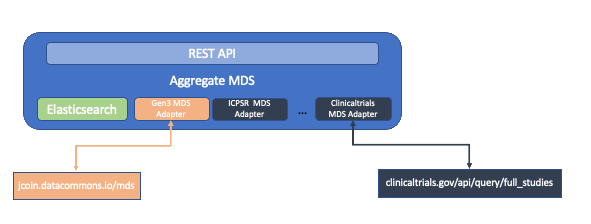

# Gen3 Metadata Adapters

Ingesting data into an Aggregate Metadata Service from a remote Metadata
Service is handled by an adapter. An adapter is used to interface with a
metadata API to pull study or item metadata into the Aggregate Metadata
Service. The adapter is called when the Aggregate MDS is populated,
either when it is started or on-demand. The adapter assists in the ETL
process to pull, cleanup and normalize metadata before it is loaded. The
adapters are configurable by a JSON object which is described below.

*Adapters enable pulling metadata from a remote service*

## Introduction

The adapter works in the following order of operations:

1.  Initialize the adapter with the parameters read from the
    configuration file.
2.  Access the remote data API via an HTTP GET or POST command
3.  Depending on the API and parameters, pull all data or a selected
    subset of Metadata
4.  For each pulled metadata entry:
    -   normalize metadata field (i.e. map remote name to standard name)
    -   optionally filter the field data (remove HTML tags, email addresses, etc.)
    -   optionally add original fields into a normalized entry
    -   apply global filters
5.  Add per item values

## Configuration

A metadata service is configurable via a JSON object, with the following format:

```json
{
  ...

"ICPSR": {
  "mds_url": "https://www.icpsr.umich.edu/icpsrweb/neutral/oai/studies",
  "commons_url": "https://www.icpsr.umich.edu",
  "adapter": "icpsr",
  "filters": {
    "study_ids": [30122, 37887, 37833, 37842, 37841, 35197 ]
  },
  "field_mappings" : {
      "tags": [],
      "sites": "",
      "year" : "2020",
      "shortName":"study_name",
      "location": "path:coverage[0]",
      "summary": {
            "path":"description",
            "filters": ["strip_html"]
      },
      ...
    },
    "per_item_values" : {
      "10.3886/ICPSR30122.v5": {
        "__manifest": [
          {
            "md5sum": "7cf87ce47b91e3a663322222bc22d098",
            "file_name": "example1.zip",
            "file_size": 23334,
            "object_id": "dg.XXXX/208f4c52-771e-409a-c920-4bcba3c03c51",
            "commons_url": "externaldata.commons1.org"
          }
        ],
        "data_availability": "available",
        "authz": "/programs/open",
      },
      ...
    }
  }
  ...
}
```
*A sample configuration file*

Any number of adapters can be added to a configuration file as long as the
key per adapter is unique.
### Parameters

The parameters of an adapter are:
 * ```mds_url```: URL of the metadata serviceAPI.
 * ```commons_url```: the URL for the homepage the metadata source
 * ```adapter```: registered name of the adapter, used to bind a particular
adapter to a site: NOTE there is no checking to ensure that the correct
adapters are being used. Usually, in the case of a mismatch, errors are
logged and nothing is pulled.
* ```filters```: the parameters (or filter
properties) passed to the adapter, this is adapter specific. In the
above example, the ```study_id``` parameter is selecting which study ids to
pull from ICPSR.

### Field Mappings
The next section of the configuration, is the field mappings which map a field name from the remote metadata into a standard name. This process is also called normalization. The mapping is simply the name of the normalized field (what is stored in the Aggregate metadata service ) to the remote field. Think of it as ```AggMDS field = Remote Field```. While this works for simple cases, there are many instances where the field is deeper in a JSON object. To resolve this you can specify a **path selector**

### Selectors
A path from the start (or root) of a remote metadata field can be described using [JSON path syntax](https://tools.ietf.org/id/draft-goessner-dispatch-jsonpath-00.html). JSON path can be used by prefixing ```path:``` to a JSON path expression to the field you want to get the value for. For example, if you wanted to get the first official name in the array OverallOfficial the selection would be  ```path:OverallOfficial[0].OverallOfficialName```

You can experiment with JSON paths using a [JSON Path editor](https://jsonpath.com/).

### Filters

The above methods should allow you to pull any nested value from a metadata entry. There are also cases where the metadata needs further processing or filtering. While this can be done in Python, by writing a new or extending an existing adapter, there is also the option to apply a filter. A filter can be added to a field using the long mapping form:
```json
"summary": {
      "path":"description",
      "filters": ["strip_html"]
}
```
In this case, the ```summary``` is set to a JSON object which optionally defines a JSON path and an array of one or more filters to apply. The filters are applied to the text value of the remote field. Furthermore, the filters are applied in the order they appear. The current set of filters are:

* strip_html: remove HTML tags from a text field
* strip_email: remove email addresses from a text field
* add_icpsr_source_url: creates a url to the study data on ICPSR
* add_clinical_trials_source_url: creates a url to the study on clinicaltrials.gov

You can add your own filters, and register them by creating a python function with the signature:
```python
def filter_function(s:str) -> str:
  ...
```

### Default Values
Defining default values for fields is quite simple: define the normalized field name and a value. If a remote metadata field has a value, it will override the default.

### Per Item Overrides

The configuration file also supports what is called per item overrides. This gives you the ability to override or add values to specific metadata entries after they are normalized but before they are added to the Aggregate Metadata. To override an item value, add a JSON object with the id of the item you want to override, as shown in the figure above. The JSON object should set each field that you to override. In the case the item is not present, the per item values are ignored. If the per item values are not present in the normalized fields, they are added.

## Writing a new Adapter

Creating a new adapter requires writing a class in Python. The minimal effort
would require writing a REST call to the remote adapter and it adding to the
adapter registry. The Adapter SDK, provides a base class which can be extended as needed. The base class is shown below:

```Python
class RemoteMetadataAdapter(ABC):

    @abstractmethod
    def getRemoteDataAsJson(self, **kwargs) -> Tuple[Dict, str]:
        """ needs to be implemented in derived class """

    @abstractmethod
    def normalizeToGen3MDSFields(self, data, **kwargs) -> Dict:
        """ needs to be implemented in derived class """

    @staticmethod
    def mapFields(item: dict, mappings: dict, global_filters: list = []) -> dict:
      """
      maps fields from the remote field name to the normalized, or
      standardized version. Unless you need special processing this function can be used as-is.
      parameters:
        * item: metadata entry to be mapped
        * mappings: a dictionary of the remote field to normalize, this
                    passed in from the configuration file_name
        * global_filters to apply
      """

    @staticmethod
    def setPerItemValues(item: dict, perItemValues: dict) -> None:
      """
      Overrides the item field values with those in perItemsValues.
      parameters:
        * item: metadata entry to override
        * perItemValues: a dictionary of field names to values
      """
```

The two functions you need to override are: ```getRemoteDataAsJson``` and
```normalizeToGen3MDSFields```. The first will call a remote API and returns a dictionary of the form:
```Python
results = {"results": []}
```
where each entry in the array is a JSON/Python dict. This function typically
requires the least custom code. Feel free to use the existing set of adapters as a guide. 
The code can be found in [adapters.py](https://github.com/uc-cdis/metadata-service/blob/chore/add_adapter_doc/src/mds/agg_mds/adapters.py)

The second function ```normalizeToGen3MDSFields``` is usually quite
simple to code, and usually requires an additional function which is named ```addGen3ExpectedFields```. The code below is very typical for an adapter.

```Python

def addGen3ExpectedFields(item, mappings, keepOriginalFields, globalFieldFilters):
    """
    Given an item (metadata as a dict), map the item's keys into
    the fields defined in mappings. If the original fields should
    be preserved set keepOriginalFields to setPerItemValues.
    * item: metadata to map fields from -> to
    * mapping: dict to map field_name (possible a JSON Path) to a  normalize_name
    * keepOriginalFields: if True keep all data in the item, if False only those fields in mappings
                          will be in the returned item
    * globalFieldFilters: filters to apply to all fields
    """
    results = item
    if mappings is not None:
        mapped_fields = RemoteMetadataAdapter.mapFields(
            item, mappings, globalFieldFilters
        )
        if keepOriginalFields:
            results.update(mapped_fields)
        else:
            results = mapped_fields

    return results
```
The above code basically checks to see if any mapping is defined. If not
then the item is returned. If a mapping does exist then we call ```RemoteMetadataAdapter.mapFields``` which will do the mapping and apply
any filters. If you want to keep the original fields, set keepOriginalFields to true. This function usually can be used as is, however in some cases if there is
a need for additional per item processing, it should be done in this function.

```python
def normalizeToGen3MDSFields(self, data, **kwargs) -> Dict[str, Any]:
    """
    Iterates over the response.
    * data: input metadata to normalize
    * kwargs: key value parameters passed as a dict
    return: dict of results where the keys are identifiers in the Gen3 metadata format:
            "GUID" : {
                "_guid_type": "discovery_metadata",
                "gen3_discovery": normalize_item_metadata
                }
    """

    mappings = kwargs.get("mappings", None)
    study_field = kwargs.get("study_field", "gen3_discovery")
    keepOriginalFields = kwargs.get("keepOriginalFields", True)
    globalFieldFilters = kwargs.get("globalFieldFilters", [])

    results = {}
    for guid, record in data["results"].items():
        item = Gen3Adapter.addGen3ExpectedFields(
            record[study_field], mappings, keepOriginalFields, globalFieldFilters
        )
        results[guid] = {
            "_guid_type": "discovery_metadata",
            "gen3_discovery": item,
        }

    perItemValues = kwargs.get("perItemValues", None)
    if perItemValues is not None:
        RemoteMetadataAdapter.setPerItemValues(results, perItemValues)

    return results
```

The code above does the following:
  1. Extract the parameters from the kwargs (dict of parameters)
  2. For each (id, item) received from the remote metadata API:
    * map study fields to normalize name by calling ```addGen3ExpectedFields```
    * Set the results into a dictionary of metadata GUIDS
  3. Apply any perItemValues defined in the config file
  4. Return the results


While the Adapters use Object Oriented Programming, you actually do not need to extend from the classes as long as you create a class with the above signature you should be fine.

### Adding your Adapter
Adding your adapter and or filters to be called by the populate process is still in the design phase. Currently, this requires adding the adapter code into the source code of the Gen3 metadata-service. However, shortly we will move to a plugin-based model.
